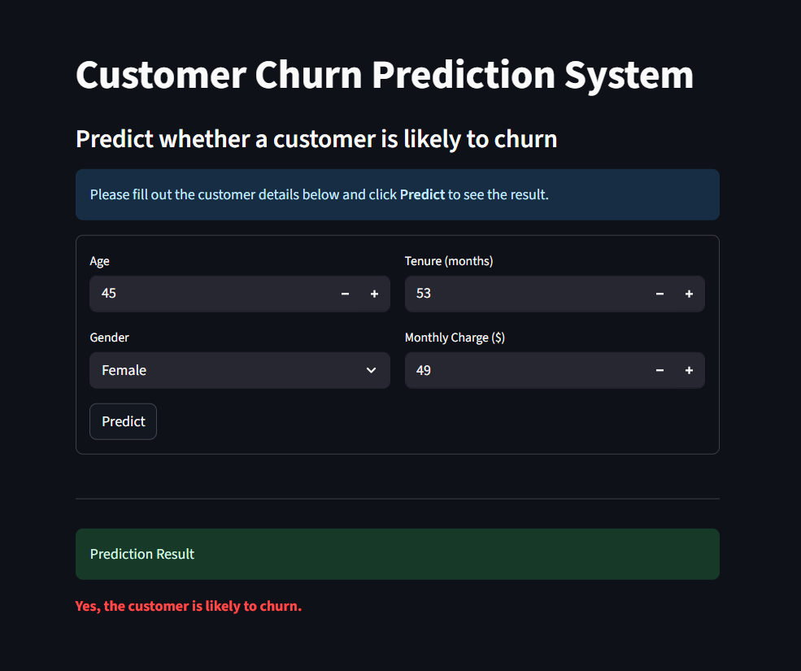

#  Customer Churn Prediction

This project is an interactive **Customer Churn Prediction System** built using **Python**, **Machine Learning**, and an intuitive **Streamlit** interface. It helps businesses identify customers who are likely to discontinue a service based on behavioral and demographic attributes.

At its core, the system analyzes patterns in customer data and makes real-time predictions about churn risk. The model is trained using real-world customer data, with key insights derived through data exploration and feature engineering. The user interface enables easy input of customer details and provides instant churn predictions along with interpretability through model insights.

Designed to be insightful, responsive, and ready for practical deployment, this project showcases how Machine Learning can be embedded into user-centric applications for strategic decision-making.



---

##  Features

- Real-time churn prediction using trained ML models
- Interactive and clean UI built with **Streamlit**
- Automated data preprocessing and transformation pipeline
- Easy-to-use form for customer attribute input
- Insightful visualizations and feedback for model decisions

---

##  How It Works

1. The system takes in structured customer data via the Streamlit app.
2. Preprocessing and feature transformations are applied automatically.
3. The trained model predicts whether the customer is at risk of churn.
4. Results are displayed instantly within the interface.

---

## 📁 Folder Structure
```
Customer-Churn-Prediction/
├── Customer_Churn_Prediction.ipynb # Data analysis, model training, and .pkl generation
├── app.py # Streamlit web app
├── screenshots/ # Screenshots of the UI
│ └── churn_ui.png
├── requirements.txt # Project dependencies
└── README.md
```

---

##  Dataset & Artifacts

Due to GitHub's file upload limitations, the following files are **not included** in this repository:
- `model.pkl` – Trained Machine Learning model
- `scaler.pkl` – Feature scaler used during model training

###  Dataset Link:
[**Download the dataset here**](https://www.kaggle.com/datasets/abdullah0a/telecom-customer-churn-insights-for-analysis)

###  Generate Required Files:
To generate the missing `.pkl` files:
1. Download the dataset and place it in the project folder.
2. Run the Jupyter notebook:
```bash
jupyter notebook Customer_Churn_Prediction.ipynb
```
This will automatically:

- Preprocess the data  
- Train the model  
- Save `model.pkl` and `scaler.pkl` in your working directory

---

##  Getting Started

### 1. Clone the repository

```bash
git clone https://github.com/AbdullahShariq/Churn-Prediction.git
cd Churn-Prediction
```
### 2. Install dependencies
```bash
pip install -r requirements.txt
```
### 3. Run the Streamlit app
```bash
streamlit run app.py
```

---

##  Technologies Used

- Python  
- Pandas  
- Scikit-learn  
- Streamlit  
- Jupyter Notebook


